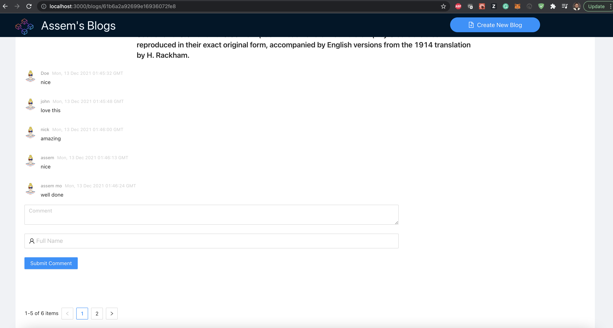

## Enable ENV

Rename `.env.example` to be `.env`
Then change backend url inside of it in case you have changed backend port `REACT_APP_API_URL='http://localhost:8000'
`

## Available Scripts

In the project directory, you can run:

### `yarn`

Install node_modules

### `yarn start`

Runs the app in the development mode.\
Open [http://localhost:3000](http://localhost:3000) to view it in the browser.

## Available Routes & Pages

In this project you can navigate to:

### `http://localhost:3000/blogs`

This will route you to all blogs page where you can select any blog to view it's details

### `http://localhost:3000/blogs/{BLOG_ID}`

This will route you to blog details page which have 2 sections the first one is the
Blog details and the second one is the comments section which have pagination and add 
New comment feature

### `http://localhost:3000/createBlog`

This will route you to create new blog page which is a form to submit blog details
Note that the form have validation over the data also the backend

